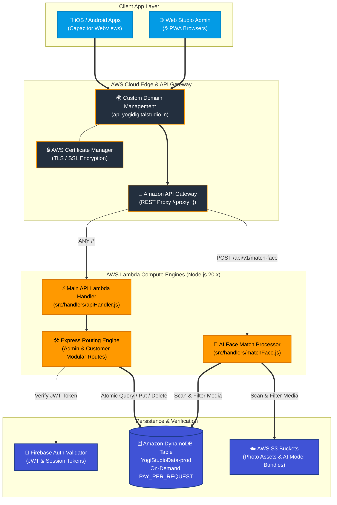
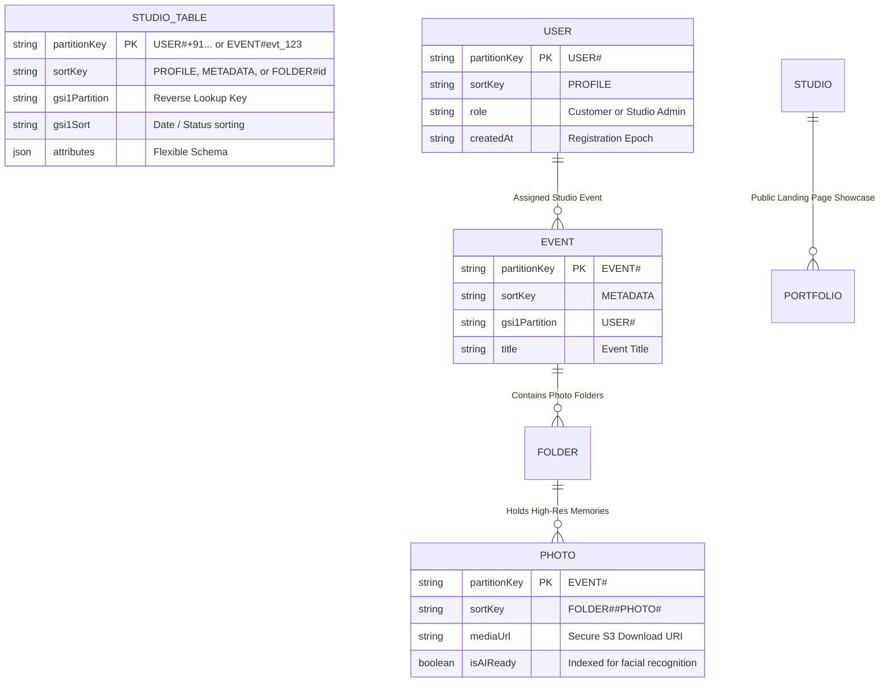
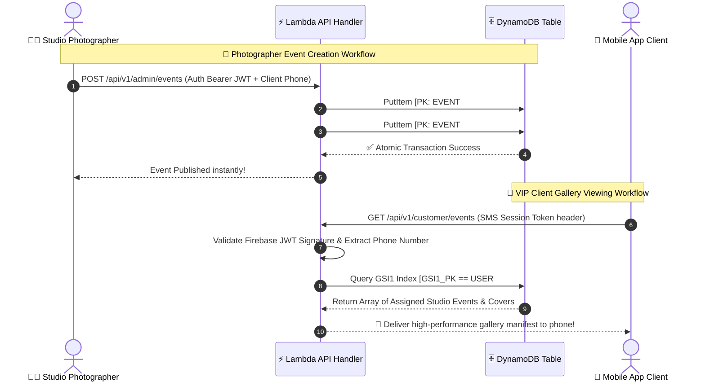

# ⚡ Yogi Digital Studio — AWS Serverless Backend Architecture

The robust, highly secure, event-driven cloud cloud core that powers the real-time photo gallery experience for Yogi Digital Studio web applications and native iOS / Android mobile apps.

 

 

---

## 📲 Client Applications & Download Links

This Serverless backend continuously handles thousands of concurrent secure data streams for our official cross-platform client releases:

| Platform | Download / Access Link | Supported Frontend Branch |
| :--- | :--- | :--- |
| **Google Play Store (Android)** | <!-- REPLACE_WITH_YOUR_PLAYSTORE_LINK_HERE --> *(Coming Soon)* | `mobile` (Capacitor Android) |
| **Apple App Store (iOS & iPadOS)** | [Download on App Store](https://apps.apple.com/in/app/yogi-digital-studio/id6790760209) 🚀 | `mobile` (Capacitor iOS) |
| **Live Web Studio & PWA** | [https://yogidigitalstudio.in](https://yogidigitalstudio.in) | `main` (React + Vite Web) |

---

## ☁️ AWS Cloud System Architecture

Our backend employs a serverless, zero-maintenance cloud design pattern on **AWS (ap-south-1 Mumbai)**. By utilizing custom Lambda proxying and Amazon DynamoDB On-Demand billing, the system scales from zero to tens of thousands of concurrent photo downloads in milliseconds.

---

## 🗄️ DynamoDB Single-Table Database Schema

Instead of relying on slow relational JOINs, this API utilizes advanced **AWS Single-Table Design** principles. All studio domain entities—Users, Events, Folders, Photos, and Showcase Portfolios—reside inside a single atomic table (`YogiStudioData-${stage}`) indexed via composite Partition Keys (`PK`) and Sort Keys (`SK`).

### Key Query Advantages of this Schema
* **Get All Events for a Customer in 1 Millisecond:** Query Global Secondary Index (`GSI1`) where `GSI1_PK = USER#+919876543210`.
* **Atomic Event Retrieval:** Query Primary Table where `PK = EVENT#evt_123` retrieves the event title, all sub-folders, and every single photograph inside a single network round-trip!

---

## 🔄 API Execution Workflow (Secure Data Stream)

Below is an overview of how our API securely routes admin gallery uploads and client photo viewing requests:

---

## 🔐 Privacy Security & Cascading Integrity

* **Zero-Leak Deletion Support:** Complements Apple App Store Guideline 5.1.1(v). When a user self-terminates their authenticated account identity on mobile, their session authorization expires immediately.
* **Cascading Admin Management (`src/routes/admin.js`):** Should a studio photographer execute a `DELETE /api/v1/admin/users/:phone` request, our custom backend automates a sweeping cascading query—safely stripping out the user profile along with all linked entity associations in DynamoDB without residual orphan items.

---

## 📄 Proprietary Ownership
All cloud infrastructural definitions (`serverless.yml`), Lambda routing models, security frameworks, and API architectures are the confidential and proprietary property of **Yogi Digital Studio**.
